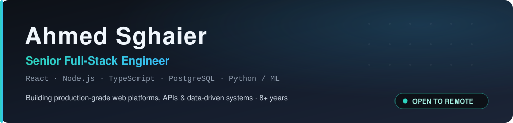
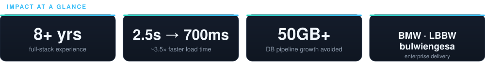

 

**🌍 Open to select Senior Full-Stack opportunities · Remote, worldwide**

 

## 🚀 About Me

I'm a **Senior Full-Stack Engineer** who helps teams ship reliable, **data-heavy products end-to-end** — from frontend architecture and API design to database modeling, performance, CI/CD, and production support.

My work spans **real-estate analytics platforms, production banking systems, and ML-driven predictive tooling**, and I'm equally comfortable owning a feature from first commit to production or improving a system others already depend on.

- 🔭 Currently building the **RIWIS** real-estate data & analytics system at **bulwiengesa GmbH**
- ⚡ I care about **measurable impact** — faster load times, leaner pipelines, reliable APIs
- 🧠 Comfortable at the intersection of **full-stack engineering and machine learning**
- 🗣️ German (C1) · English (B2) · French (fluent) · Arabic (native)

## 🛠️ Tech Stack

| Domain | Technologies |
| :-- | :-- |
| **Frontend** |        |
| **Backend** |       |
| **Databases** |      |
| **DevOps & Tools** |      |
| **Data & AI** |    |

## 💼 Professional Experience

### 🏢 bulwiengesa GmbH — *Senior Full-Stack Engineer*
`01/2021 – Present · Munich, Germany`

End-to-end development of **RIWIS**, a real-estate data & analytics platform.

> **Impact:** faster core workflows, a leaner data pipeline, and a print product reborn as an online feature.

- ⚡ Reduced object-view load time from **~2.5s → ~700ms** (~3.5× faster)
- 🤖 Built a **real-time price-prediction API** (Python + ML), replacing a monthly DB pipeline and preventing **50GB+** table growth
- 📊 Digitized the *Dev-Monitor* report from an annual print magazine into an always-available online product
- 🔧 Implemented CI/CD workflows; partnered with product, analysts, and data science
- **Stack:** React · Node.js · TypeScript · PostgreSQL · Python/ML · Tailwind · Vite · Jenkins · GitLab CI · ELK

### 🏦 LBBW — *IT Solution Designer / Software Developer*
`10/2019 – 12/2020 · Stuttgart, Germany`

Production **Calypso** banking system — features, stability, and monitoring.

> **Impact:** reliable regulatory delivery, faster reporting, and clearer operational visibility.

- Delivered regulatory/business-driven changes, workflow rules, and scheduled tasks
- Automated **PDF confirmation & report generation** and reduced generation time
- Integrated **Elasticsearch/ELK** for centralized operational visibility
- **Stack:** Java 8+ · SQL · XML · JBoss · JUnit · Elasticsearch

### 🚗 BMW Group — *Master Thesis / Data Scientist*
`02/2019 – 09/2019 · Munich, Germany`

**Predictive failure detection** for test benches using event logs & sensor data.

- Built an initial ML model for failure detection and future-failure prediction
- Identified root causes from unstructured, heterogeneous data sources
- **Stack:** Python · Machine Learning · Data Mining · MongoDB · Angular

### 🔎 Glanos GmbH — *Full-Stack / ML Software Developer*
`08/2017 – 02/2019 · Munich, Germany`

Data-driven web apps and text-analytics features (NER, matching, ML modules).

- **Stack:** Angular · Python · Node.js · Machine Learning · Text Analytics

<b>📁 Earlier experience</b>

 

- **LMU – Chair of Data Science** · Frontend Web Developer · `2017–2018` — Angular 5, forms, routing, HTTP, responsive UX
- **Elunic Software Engineering** · Software Developer · `2016–2017` — B2B web, PHP/SQL/JS/Node.js
- **SEMCO Software Engineering** · Software Developer · `2015–2016` — web software, backend & database features
- **Cayero Internet** · PHP Developer · `2015` — full-stack PHP web development

## 🧪 Featured Projects

| | |
| :-- | :-- |
| **🧾 [Rapid-Test Booking Platform](https://github.com/A7med-Sghaier/rapid-test-booking-platform)** Full-stack booking platform with JWT auth, QR/PDF workflows, email notifications, and admin dashboards.      | **🏢 [Agency Platform — as-tinodev-web](https://github.com/A7med-Sghaier/as-tinodev-web)** Full-stack agency site with a PostgreSQL-backed CMS, admin auth, lead management, media uploads, tests, and CI.      |
| **🌫️ [Air-Quality Prediction Platform](https://github.com/A7med-Sghaier/air-quality-prediction-platform)** Full-stack air-quality prediction platform with an Angular dashboard, Python Falcon API, and ML preprocessing.      | **📰 [InnoLab CMS Portal](https://github.com/A7med-Sghaier/innolab-cms-portal)** Dockerized Angular + Strapi CMS portal with sanitized demo data and copyright-safe placeholder media.      |

Also: [product-rental-javafx](https://github.com/A7med-Sghaier/product-rental-javafx) — JavaFX + SQLite desktop app for managing product rentals.

## 🤝 What I Bring to a Team

| | |
| :-- | :-- |
| **🚀 End-to-end ownership** From architecture and API design through database, tests, CI/CD, and production support. | **⚡ Measurable performance wins** I optimize real bottlenecks (e.g. **~2.5s → ~700ms**) instead of chasing micro-tweaks. |
| **🤖 ML-integrated delivery** I bridge product engineering and machine learning, shipping prediction APIs and data-driven features to production. | **🛠️ Production maturity** CI/CD, monitoring (ELK/Elasticsearch), and clean, documented code teams can maintain and scale. |

## 🎯 Engineering Principles

Clear, maintainable code · Practical architecture over complexity · Reliable APIs & database design 
Documentation that helps projects scale · Measurable performance wins · Testing, CI/CD & production-minded delivery

## 🎓 Certifications

<table>
<tr>
<td align="center" width="50%">
 
<b><a href="https://www.credly.com/badges/00c3ad03-de79-4782-896f-794ea9f895de/public_url">LFW111 — Introduction to Node.js</a></b> 
The Linux Foundation · Sep 2025 
✓ Verified on Credly
</td>
<td align="center" width="50%">
 
<b><a href="https://www.credly.com/badges/eea280b5-a94a-40d5-9194-4c7df4ce81e0/public_url">LFS101 — Introduction to Linux</a></b> 
The Linux Foundation · Sep 2025 · ID <code>LF-s8gawrwd4p</code> 
✓ Verified on Credly
</td>
</tr>
</table>

**🗣️ German — C1 (CEFR)** · professional working proficiency (language certificate) &nbsp;·&nbsp; 🔗 [View all verified badges on Credly →](https://www.credly.com/users/ahmed-sghaier.61242d1c)

## 🐧 Open Source & Community

- Presented educational material on **Ubuntu, Linux, Open Source, and OpenStack** with the *Ubuntu TunisianTeam* community
- Covered Linux certification topics in academic/training contexts

 

 

